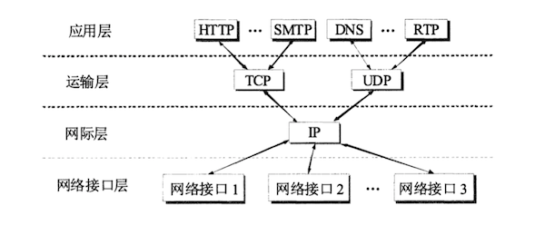

前面已经说过，TCP/IP的体系结构比较简单，它只有四层。如下图给出了用这种四层协议表示方法的例子。请注意，图中的路由器在转发分组时最高只用到网络层而没有使用运输层和应用层。

应当指出，技术的发展并不是遵循严格的OSI分层概念。实际上现在的互联网使用的TCP/IP体系结构有时已经演变成为下图所示的那样，即某些应用程序可以直接使用IP层，或甚至直接使用最下面的网络接口层[PETE11]，下图是这种表示方法。在图中，网络接口层有时也称为子网层。但本书不采用“子网层”这种容易混淆的表示方法，因为这里的“子网”是指一些局域网和某些广域网（如ATM网），但从IP层来看，这些网络属于数据链路层，也就是属于网络接口层。

还有一种方法，就是分层次画出具体的协议来表示TCP/IP协议族，如下图，它的特点是上下两头大而中间小：应用层和网络接口层都有多种协议，而中间的IP层很小，上层的各种协议都向下汇聚到一个IP协议中。这种很像沙漏计时器形状的TCP/IP协议族表明：TCP/IP协议**可以为各式各样的应用提供服务**（所谓的everything over IP），同时TCP/IP协议也**允许IP协议在各式各样的网络构成的互联网上运行**（所谓IP over everything）。正因为如此，互联网才会发展到今天这种全球规模。从下图不难看出IP协议在互联网中的核心作用。

