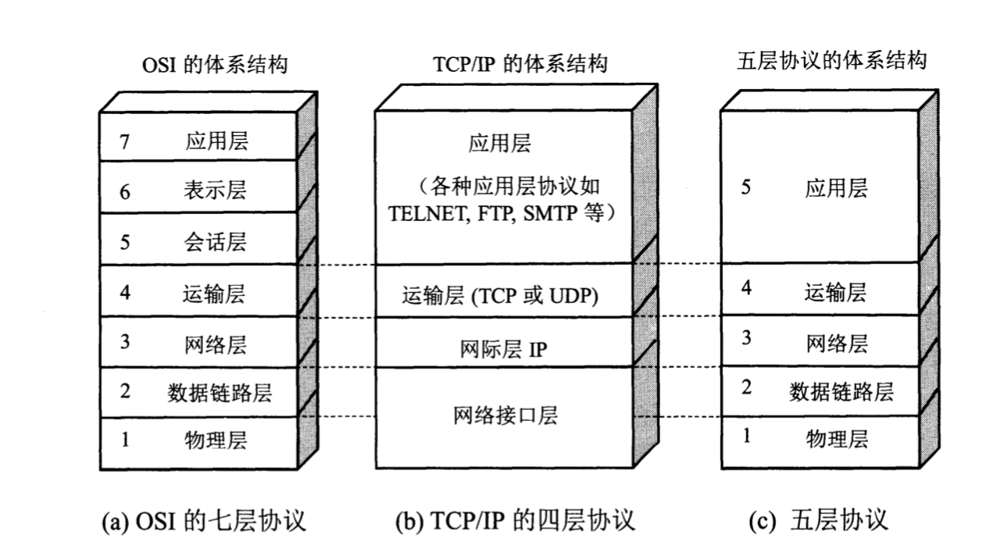

OSI的七层协议体系结构的概念清楚，理论也较完整，但它既复杂又不实用。TCP/IP体系结构则不同，但它现在却得到了非常广泛的应用。TCP/IP是一个四层的体系结构，它包含应用层，运输层，网际层和网络接口层（用网际层这个名字是强调这一层是为了解决不同网络的互连问题）。不过从实质上讲，TCP/IP只有最上面的三层，因为最下面的网络接口层并没有什么具体内容。因此在学习计算机网络的原理时往往采取折中的办法，即综合OSI和TCP/IP的优点，采用一种只有五层协议的体系结构，这样既简洁又能将概念阐述清楚。有时为了方便，也可把最底下两层称为网络接口层。

现在结合互联网的情况，自上而下地、非常简要地介绍一下各层的主要功能。实际上，只有认真学完本书各章的协议后才能真正弄清楚各层的作用。

(1) **应用层**(application layer)

应用层是体系结构的最高层。应用层的任务是**通过应用进程间的交互来完成特定网络应用**。应用层协议定义的是**应用进程通信和交互的规则**。这里的**进程**就是指主机中**正在运行的程序**。对于不同的网络应用需要有不同的应用层协议。在互联网中的应用层协议很多，如域名系统DNS，支持万维网应用的HTTP协议，支持电子邮件的SMTP协议，等等。我们把应用层交互的数据单元称为**报文**(message)。

(2) **运输层**(transport layer)

运输层的任务就是负责向**两台主机中进程之间的通信**提供**通用的数据传输**服务。应用进程利用该服务传送应用层报文。所谓“通用的”，是指并不针对某个特定网络应用，而是多种应用可以使用同一个运输层服务。由于一台主机可以同时运行多个进程，因此运输层有复用和分用的功能。复用就是多个应用层进程可同时使用下面运输层的服务，分用和复用相反，是运输层把收到的信息分别交付上面应用层中的相应进程。

运输层主要有下面两种协议:

- **传输控制协议TCP**(Transmission Control Protocol): 提供面向连接的、可靠的数据传输服务，其数据传输的单位是**报文段**(segment)。
- **用户数据报协议UDP**(User Datagram Protocol): 提供无连接的、**尽最大努力**(best-effort)的数据传输服务(不保证数据传输的可靠性)，其数据传输的单位是**用户数据报**。

顺便指出，有人愿意把运输层称为传输层，理由是这一层使用的TCP协议就叫做传输控制协议。从意思上讲，传输和运输差别也不大。但OSI定义的第4层使用的是Transport，而不是Transmission。这两个字的含义还是有些差别。因此，使用运输层这个译名较为准确。

(3) **网络层**(network layer)

网络层负责为分组交换网上的不同**主机**提供通信服务。在发送数据时，网络层把运输层产生的报文段或用户数据报封装成**分组**或**包**进行传送。在TCP/IP体系中，由于网络层使用IP协议，因此分组也叫做**IP数据报**，或简称为**数据报**。**本书把“分组”和“数据报”作为同义词使用**。

>请注意：不要将运输层的“用户数据报UDP”和网络层的“IP数据报”弄混。此外，**无论在哪一层传送的数据单元，都可笼统地用“分组”来表示**。

网络层的另一个任务就是要选择合适的路由，使源主机运输层所传下来的分组，能够通过网络中的路由器找到目的主机。

这里要强调指出，网络层中的“**网络**”二字，已不是我们通常谈到的具体网络，而是在计算机网络体系结构模型中的第3层的名称。

互联网是由大量的**异构**(heterogeneous)网络通过**路由器**(router)互相连接起来的。互联网使用的网络层协议是无连接的**网际协议IP**(Internet Protocol)和许多种路由选择协议，因此互联网的网络层也叫做**网际层**或**IP层**。在本书中，网络层、网际层和IP层都是同义语。

(4) **数据链路层**(data link layer)

数据链路层常简称为**链路层**。我们知道，两台主机之间的数据传输，总是在一段一段的链路上传送的，这就是需要使用专门的链路层的协议。在两个相邻结点之间传送数据时，数据链路层将网络层交下来的IP数据报**组装成帧**(framing)，在两个相邻结点间的链路上传送**帧**(frame)。每一帧包括数据和必要的**控制信息**(如同步信息、地址信息、差错控制等)。

在接收数据时，控制信息使接收端能够知道一个帧从哪个比特开始和到哪个比特结束。这样，数据链路层在收到一个帧后，就可以从中提取出数据部分，上交给网络层。

控制信息还使接收端能够检测到所收到的帧中有无差错。如发现有差错，数据链路层就简单地**丢弃**这个差错的帧，以免继续在网络中传送下去白白浪费网络资源。如果需要改正数据在数据链路层传输时出现的差错(这就是说，数据链路层不仅要检错，而且要纠错)，那么就要采用可靠传输协议来纠正出现的差错。这种方法会使数据链路层的协议复杂些。

(5) **物理层**(physical layer)

在物理层上所传数据的单位是**比特**。发送方发送1（或0）时，接收方应当收到1（或0）而不是0（或1）。因此物理层要考虑用多大的电压代表“1”或“0”，以及接收方如何识别出发送方所发送的比特。物理层还要确定连接电缆的插头应当有多少根引脚以及各引脚应如何连接。当然，解释比特代表的意思，就不是物理层的任务。请注意，传递信息所利用的一些物理媒体，如双绞线、同轴电缆、光缆、无线信道等，并不在物理层协议之内而是在物理层协议的下面。因此也有人把物理层下面的物理媒体当作第0层。

在互联网所使用的各种协议中，最重要的和最著名的就是TCP和IP两个协议。现在人们经常提到的TCP/IP并不一定是单指**TCP**和**IP**这两个具体的协议，而往往是表示互联网所使用的整个**TCP/IP协议族**(protocol suite)。

下图说明的是应用进程的数据在各层之间的传递过程中所经历的变化。这里最为简单起见，假定两台主机通过一台路由器连接起来。

假定主机1的应用进程AP1向主机2的应用进程AP2传送数据。AP1先将其数据交给本主机的第五层（应用层）。第五层加上必要的控制信息H5就变成了下一层的数据单元。第4层（运输层）收到这个数据单元后，加上本层的控制信息H4，再交给第3层（网络层）,成为第3层的数据单元。依此类推。不过到了第2层（数据链路层）后，控制信息被分成两部分，分别加到本层数据单元的首部（H2）和尾部（T2）；而第1层（物理层）由于是比特流的传送，所以不再加上控制信息。请注意，传送比特流时应从首部开始传送。

OSI参考模型把对等层次之间传送的数据单位称为该层的**协议数据单元**PDU(Protocol Data Unit)。这个名词现已被许多非OSI标准采用。

当这一串的比特流离开主机1经网络的物理媒体传送到路由器时，就从路由器的第1层依次上升到第3层。每一层都根据控制信息进行必要的操作，然后将控制信息剥去，将该层剩下的数据单元交给更高的一层。当分组上升到第3层时，就根据首部中的目的地址查找路由器中的转发表，找出转发分组的接口，然后往下传送到第2层，加上新的首部和尾部后，再到最下面的第1层，然后在物理媒体上把每一个比特发送出去。

当这一串的比特流离开路由器到达目的站主机2时，就从主机2的第1层按照上面讲过的方式，依次上升到第5层。最后，把应用进程AP1发送的数据交给目的站的应用进程AP2。

可以用一个简单的例子来比喻上述过程。有一封信从最高层向下传。每经过一层就包上一个新的信封，写上必要的地址信息。包有多个信封的信件传送到目的站后，从第一层起，每层拆开一个信封后就把信封的信交给它的上一层。传到最高层后，取出发信人所发的信交给收信人。

虽然应用进程数据要经过如上图所示的复杂过程才能送到终点的应用进程，但这些复杂过程对用户来说，却都被屏蔽掉了，以致应用的应用进程AP1觉得好像是直接把数据交给了应用进程AP2。同理，任何两个同样的层次（例如在两个系统的第4层）之间，也好像如同上图中的水平虚线所示的那样，把数据（即数据单元加上控制信息）通过水平虚线直接传递给对方。这就是所谓的“**对等层**”（peer layers）之间的通信。我们以前经常提到的各层协议，实际上就是在各个对等层之间传递数据时的各项规定。

