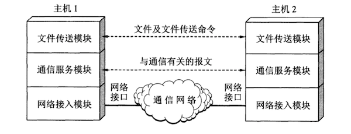

在计算机网络中要做到有条不紊地交换数据，就必须遵守一些事先约定好的规则。**这些规则明确规定了所交换的数据的格式以及有关的同步问题**。这里所说的同步不是狭义的（即同频或同频同相）而是广义的，即在一定的条件下应当发生什么事件（例如，应当发送一个应答信息），因而**同步含有时序的意思**。这些**为进行网络中的数据交换而建立的规则、标准或约定称为网络协议**（network protocol）。网络协议也可简称为**协议**。更进一步讲，网络协议主要由以下三个要素组成：

- **语法**，即数据与控制信息的结构或格式；
- **语义**，即需要发出何种控制信息，完成何种动作以及作出何种响应；
- **同步**，即事件实现顺序的详细说明。

由此可见，网络协议是计算机网络不可缺少的组成部分。实际上，只要我们想让连接在网络上的另一台计算机做点什么事情（例如，从网络上的某台主机下载文件），我们都需要有协议。但是当我们经常在自己的个人电脑上进行文件存盘操作时，就**不需要任何网络协议**，除非这个用来存储文件的磁盘是网络上的某个文件服务器的磁盘。

协议通常有两种不同的形式。一种是使用便于人来阅读和理解的文字描述。另一种是使用让计算机能够理解的程序代码。这两种不同形式的协议都必须能够对网络上的信息交换过程做出精确的解释。

ARPANET 的研制经验表明，对于非常复杂的计算机网络协议，其结构应该是层次式的。我们可以举一个简单的例子来说明划分层次的概念。

现在假定我们在 主机1 和 主机2 之间通过一个通信网络传送文件。这是一项比较复杂的工作，因为需要做不少的工作。

我们可以将要做的工作划分为三类。第一类工作与传送文件直接有关。例如，发送端的文件传送应用程序应当确信接收端的文件管理程序已做好接收和存储文件的准备。若两台主机所用的文件格式不一样，则至少其中的一台主机应完成文件格式的转换。这两项工作可用一个文件传送模块来完成。这样，两台主机可将文件传输模块作为最高的一层（如下图）。在这两个模块之间的虚线表示两台主机系统交换文件和一些有关文件交换的命令。

但是，我们并不想让文件传送模块完成全部工作的细节，这样会使文件传输模块过于复杂。可以再设立一个通信服务模块，用来保证文件和文件传送命令可靠地在两个系统之间交换。也就是说，让位于上面的文件传送模块利用下面的通信服务模块所提供的服务。我们还可以看出，如果将位于上面的文件传送模块换成电子邮件模块，那么电子邮件模块同样可以利用在它下面的通信服务模块所提供的可靠通信的服务。

同样道理，我们再构造一个网络接入模块，让这个模块负责做与网络接口细节有关的工作，并向上层提供服务，使上面的通信服务模块能够完成可靠的通信任务。

从上述简单例子可以更好地理解分层可以带来很多好处。如：

- **各层之间是独立的**。某一层并不需要知道它下一层是如何实现的，而仅仅需要知道该层通过层间的接口（即界面）所提供的服务。由于每一层只实现一种相对独立的功能，因而可将一个难以处理的复杂问题分解为若干个较容易处理的更小一些的问题。这样，整个问题的复杂程度就下降了。
- **灵活性好**。当任何一层发生变化时（例如由于技术变化），只要层间接口关系保持不变，则在这层以上或以下各层均不受影响。此外，对某一层提供的服务还可以进行修改。当某层提供的服务不再需要时，甚至可以将这层取消。
- **结构上可分开**。各层都可以采用最合适的技术来实现。
- **易于实现和维护**。这种结构使得实现和调试一个庞大而又复杂的系统变得易于处理，因为整个的系统已被分解为若干个相对独立的子系统。
- **能促进标准化工作**。因为每一层的功能及其所提供的服务都已有了精确的说明。

分层时应注意使每一层的功能非常明确。若层数太少，就会使每一层的协议太复杂。但层数太多又会在描述和综合各层功能的系统工程任务时遇到较多的困难。通常各层所要完成的功能主要有以下一些（可以只包括一种，也可以包括多种）：

- **差错控制**  使相应层次对等方的通信更加可靠。
- **流量控制**  发送端的发送速率必须使接收端来得及接收，不要太快。
- **分段和重装**    发送端将要发送的数据块划分为更小的单位，在接收端将其还原。
- **复用和分用**    发送端几个高层会话复用一条底层的连接，在接收端再进行分用。
- **连接建立和释放**    交换数据前先建立一条逻辑连接，数据传送结束后释放连接。

分层当然也有一些缺点，例如，有些功能会在不同层次中重复出现，因而产生了额外开销。

**计算机网络的各层及其协议的集合**就是网络的**体系结构**（architecture）。换种说法，**计算机网络的体系结构就是这个计算机网络及其构件所应完成的功能的精确定义**需要强调的是：这些功能究竟是用何种硬件或软件完成的，则是一个遵循这种体系结构的**实现**（implementation）的问题。体系结构的英文名词architecture的原意是建筑学或建筑的设计和风格。它和一个具体的建筑物的概念很不相同。例如，我们可以走进一个明代的建筑物中，但却不能走进一个明代的建筑建筑风格之中。同理，我们也不能把一个具体的计算机网络说成是一个抽象的网络体系结构。总之，**体系结构是抽象的，而实现则是具体的，是真正在运行的计算机硬件和软件**。