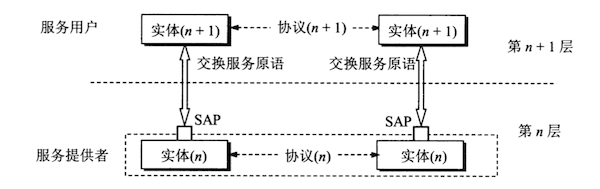

当研究开放系统中的信息交换时，往往使用**实体**（entity）这一较为抽象的名词表示**任何可发送或接收信息的硬件或软件进程**。在许多情况下，实体就是一个特定的软件模块。

**协议是控制两个对等实体**（或**多个实体**）**进行通信的规则的集合**。协议的语法方面的规则定义了所交换的信息的格式，而协议的语义方面的规则就定义了发送者或接收者所要完成的操作，例如，在任何条件下，数据必须重传或丢弃。

**在协议的控制下，两个对等实体间的通信使得本层能够向上一层提供服务。要实现本层协议，还需要使用下面一层所提供的服务**。

一定要弄清楚，协议和服务在概念上是不一样的。

首先，协议的实现保证了能够向上一层提供服务。使用本层服务的实体只能看见服务而无法看见下面的协议。也就是说，下面的协议对上面的实体是透明的。

其次，**协议是“水平的”**，即协议是控制对等实体之间通信的规则。但**服务是“垂直”的**，即服务是由下层向上层通过层间接口提供的。另外，并非在一个层内完成的全部功能都称为服务。只有那些能够被高一层实体“**看得见**”的功能才能称只为“服务”。上层使用下层所提供的服务必须通过与下层交换一些命令，这些命令在OSI中称为**服务原语**。

在同一系统中相邻两层的实体进行交互（即交换信息）的地方，它实际上就是一个逻辑接口，有点像邮政信箱（可以把邮件放入信箱和从信箱中取走邮件），但这种层间接口和两个设备之间的硬件接口（并行或串行的）并不一样。OSI把层与层之间交换数据的单位称为**服务数据单元**（Service Data Unit），它可以和PDU不一样。例如，可以是多个SDU合成为一个PDU，也可以是一个SDU划分为几个PDU。

这样，在任何相邻两层之间的关系可概括为如下图所示的那样。这里要注意的是，第n层的两个“实体（n）”之间通过“协议（n）”进行通信，而第n+1层的两个“实体（n+1）”之间则通过另外的“协议（n+1）”进行通信（每一层都使用不同的协议）。第n层向上面的第n+1层所提供的服务实际上已包括了在它以下各层所提供的服务。第n层的实体对第n+1层的实体就相当于一个服务提供者。在服务提供者的上一层的实体又称为“**服务用户**”，因为它使用下层服务提供者所提供的服务。

计算机网络的协议还有一个很重要的特点，就是协议必须把**所有**不利的条件事先都估计到，而**不能假定一切都是正常的和非常理想的**。例如，两个朋友在电话中约好，下午3点时在某地碰头，并且约定“不见不散”。这就是一个很不科学的协议，因为任何一方临时有急事来不了而又无法通知对方时（如果对方的电话或手机都无法接通），则另一方按照协议就必须永远等待下去。因此，看一台计算机网络协议是否正确，不能只看在正常情况下是否正确，而且还必须**非常仔细地检查这个协议能否应付各种异常情况**。